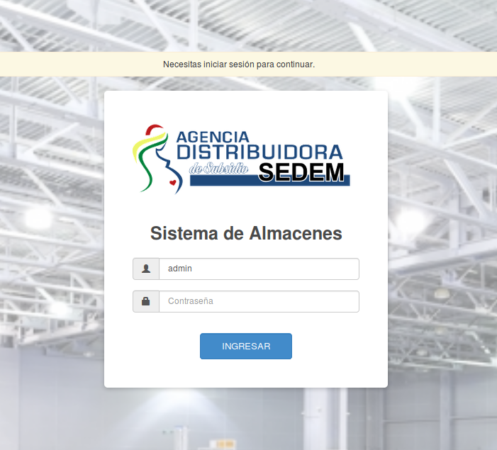
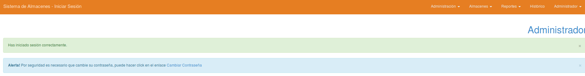
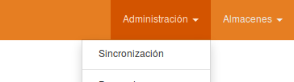
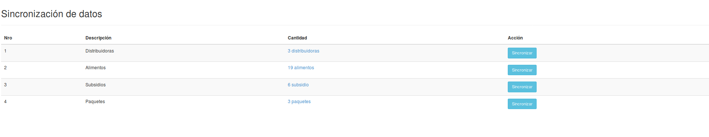

# Manual de Usuario  #
## Rol: Super Administrador ##

Primero debera loguearse al sistema

Pantalla del Administrador

## 1 Sincronización
Ahora que se esta logueado en el sistema, pasamos a Sincronizar los datos necesarios

Una vez en la pantalla de sincronización se mostraran una tabla con 4 opciones las cuales se podrán sincronizar.
Presionar los botones de sincronizacion en orden de 1 - 4 secuencialmente y se mostrara de la siguiente manera.

## 2 Creación de Usuarios ##

Para poder crear usuarios iremos a la opción Usuarios encontrada en Administración

Ahora se podra ver una lista de Usuarios

Posteriormente crearemos los nuevos usuarios

**Nota.-** Para un mejor ejemplo podemos crear por lo menos 3 usuarios y asignarlos a los almacenes Central, Producción y Distribución.

## 3 Distribuidoras ##

Ahora asignaremos los usuarios a las distribuidoras, para ello vamos al menu y escogemos la opcion "Distribuidoras"

Tendremos una vista como la siguiente, donde se pueden ver las distribuidoras sincronizadas.

En esta vista podemos ir a la opcion de ver "Botón con forma de Ojo" para poder asignar usuarios

Vista de distribuidora

#### 3.1 Asignación de Lider de Distribuidora ####

Para la asignación de Lider(s) de Almacén vamos a la opción Asignar Usuarios

nos saldra un modal en el cual buscaremos al usuario que sera el Lider de el Almacen.

#### 3.2 Creación de Subalmacenes ####

Ahora vamos a la opcion (+) para poder crear los almacenes de Central, Producción y Distribución.

En la siguiente pantalla podremos crear los diferentes almacenes y diferenciar con el nombre si es de Universal ó Prenatal y Lactancia.

Podemos ver algo Asi

#### 3.3 Asignación de Usuarios por Almacén ####

Para poder asignar un usuario a un almacén debemos ir al boton verde con imagen de usuario

Buscamos al usuario que estara asignado a ese almacén, hacemos lo mismo para los diferentes almacenes.

Una vez realizado tendremos una vista asi:

## 4 Proveedores  ##

Necesitamos cargar los proveedores de Alimentos.

Tendremos la siguiente vista:

Ahora necesitamos registrar un nuevo proveedor, para ello nos vamos a la opcion "Nuevo Proveedor".

Llenamos los datos requeridos y lo creamos.

## 5. Contratos ##

Nos vamos a la opcion de Contratos que se encuentra en el menu de Administración

Veremos la Lista de contratos

Ahora procederemos a crear un nuevo contrato, para ello vamos a la opcion "Nuevo Contrato" y llenaremos los datos que se nos pide

Despues de crear el contrato podremos ver la siguiente pantalla

### 5.1 Asignacion de Contrato a Distribuidoras ###

Ahora podemos ver una lista de alimentos correspondiente al contrato, ahora vamos a la opcion "Asignar Distribuidoras"

Asignación de Alimento a Distribuidoras

